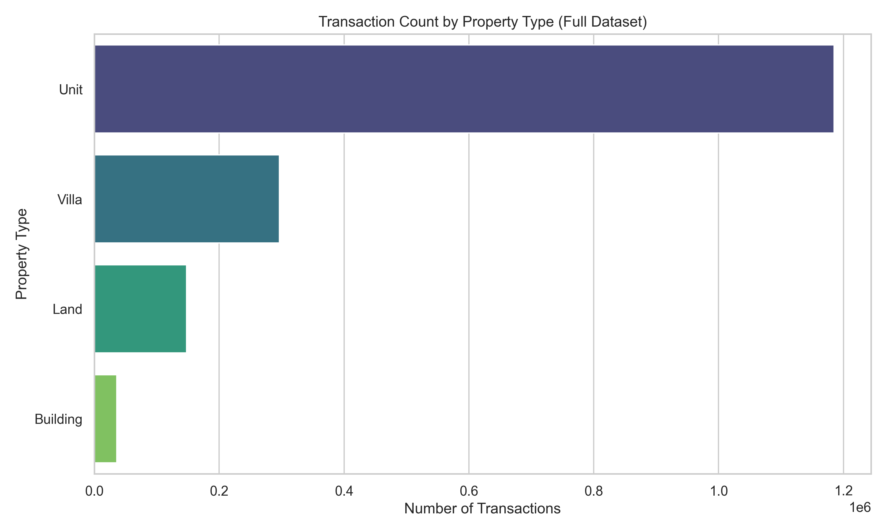
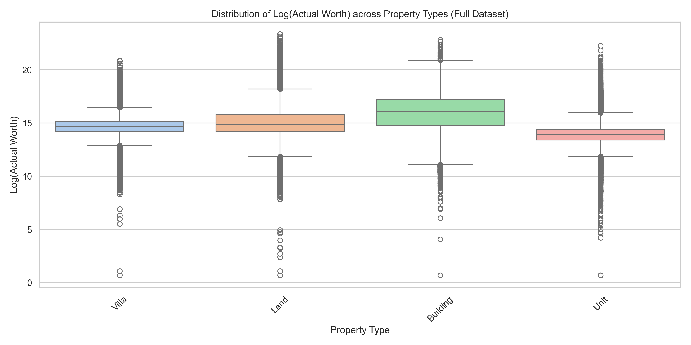

# Dubai Real Estate Transaction Segmentation — End-to-End ML Application

This repository contains an end-to-end Machine Learning web application designed to segment Dubai real estate transactions, inferring actionable customer profiles (e.g., High-Value Investors, Commercial Renters, etc.) from raw data.

---

### Table of Contents

| # | Section | Description |
| :---: | :--- | :--- |
| **1** | [Business Problem & The Data-Driven Solution](#1-business-problem--the-data-driven-solution) | Why hard-coded rules fail and how ML solves it |
| **2** | [The AI Approach: Algorithm Selection](#2-the-ai-approach-algorithm-selection) | Evaluating all 6 clustering algorithm families |
| **3** | [Empirical Benchmark: K-Means vs GMM](#3-empirical-benchmark-k-means-vs-gmm-full-16m-dataset) | Head-to-head comparison on the full 1.6M dataset |
| **4** | [Why K-Means is the Best Choice](#4-why-k-means-is-the-best-choice-for-this-project) | Scalability, explainability, and outlier mitigation |
| **5** | [Why No Other Algorithm Can Outperform K-Means](#5-why-no-other-algorithm-can-outperform-k-means-here) | Full feasibility matrix and geometric proof |
| **6** | [Pipeline Optimization: Strategy D](#6-pipeline-optimization-strategy-d-dimension-reduction) | Feature engineering: 455 → 11 features (+62% Silhouette) |
| **7** | [Why 5 Clusters?](#7-why-5-clusters-the-k-selection) | Mathematical evaluation across k=2..10 |
| **8** | [The 5 Discovered Market Segments](#8-the-5-discovered-market-segments) | Profiles, validation, silhouette, ARI, and purity tables |
| **9** | [The Data Story (Visual Evidence)](#9-the-data-story-visual-evidence) | EDA charts and the 2D PCA projection |
| **10** | [Data Source](#10-data-source) | Dubai Pulse Open Data portal link |
| **11** | [Setup & Execution](#11-setup--execution) | Installation, training, and launching the dashboard |
| **12** | [Directory Structure](#12-directory-structure) | Repository layout and saved artifacts |

---

## 1. Business Problem & The Data-Driven Solution

Real estate datasets often contain millions of rows with highly variable attributes — ranging from standard apartments to multi-billion dirham commercial projects.

Traditionally, companies classify transactions using **rigid, hard-coded rules** (e.g., "anything over 5 million dirhams is luxury"). However, this approach fails because the market is complex. A 5-million dirham transaction could be a luxury penthouse for an investor, or it could be a small commercial retail space for a corporate renter.

This project solves this by using a dynamic, data-driven approach, replacing manual guesswork with statistical profiling.

---

## 2. The AI Approach: Algorithm Selection

When solving a segmentation problem, there are 6 main families of clustering algorithms in Machine Learning. We evaluated the options below to find the best fit for our multi-dimensional real estate dataset.

### 2.1 Clustering Algorithm Comparison

| Algorithm Type | Examples | Methodology | Pros | Cons | Why it was rejected (or chosen) |
| :--- | :--- | :--- | :--- | :--- | :--- |
| **Connectivity-based** | Hierarchical (Agglomerative) | Clusters based on proximity between clusters (dendrograms). | Doesn't require setting $k$; highly visual process. | **Terrible scaling** ($O(n^3)$). Fails on massive datasets. | *Rejected*. The Dubai real estate dataset has millions of rows. Hierarchical clustering would crash due to memory limits. |
| **Density-based** | DBSCAN, HDBSCAN | Clusters based on data density instead of proximity. | Discovers complex shapes; handles outliers well automatically. | Struggles with **varying densities** and high-dimensional spaces. | *Rejected*. Real estate data is continuous and hyper-dense (prices bleed into each other without empty "gaps"). DBSCAN struggles to draw distinct boundaries here. |
| **Distribution-based** | Gaussian Mixture Models (GMMs) | Clusters based on the likelihood of belonging to the same normal distribution. | Soft clustering (probabilities); flexible cluster shapes. | Assumes data follows a strict **Gaussian (Normal) distribution**. | *Empirically Tested & Rejected*. Despite post-pipeline data being closer to Gaussian (after Log1p + RobustScaler + PCA), GMM scored worse on all metrics. See [Section 3](#3-empirical-benchmark-k-means-vs-gmm-full-16m-dataset). |
| **Graph-based** | Spectral Clustering, Affinity Propagation | Clusters based on graph distance / network connectivity. | Good for non-convex boundaries and complex graph structures. | Computationally **very expensive** for large $N$. | *Rejected*. $O(n^2)$ scaling is entirely unfit for millions of transactional records. |
| **Compression-based** | BIRCH | Transforms data to a lower dimensional tree before clustering. | Exceptional for massive, out-of-core datasets. | Only supports spherical clusters; sensitive to data ordering. | *Rejected*. While scalable, it struggles to handle the high-cardinality categorical variables present in our dataset effectively. |
| **Centroid-based** | **K-Means**, K-Medoids | Clusters points based on direct proximity to a central point (centroid). | **Highly scalable**, mathematically simple, and explainable. | Assumes spherical clusters; struggles with massive outliers. | **CHOSEN**. See [Section 4](#4-why-k-means-is-the-best-choice-for-this-project) for our exact reasoning and how we mitigated its cons. |

---

## 3. Empirical Benchmark: K-Means vs GMM (Full 1.6M Dataset)

While the algorithm comparison table above provides theoretical reasoning, we went further and **empirically benchmarked** Gaussian Mixture Models against K-Means on the exact same preprocessed data (11 PCA components from Strategy D). This is a fair test because our pipeline (Log1p + RobustScaler + PCA) transforms the originally skewed data closer to Gaussian distributions — giving GMM its best possible chance.

### 3.1 Result: K-Means Wins All 4 Metrics

| Metric | K-Means | GMM (full covariance) | Winner |
| :--- | ---: | ---: | :--- |
| **Silhouette Score** ↑ | **0.2169** | 0.1764 | **K-Means** (+23%) |
| **Davies-Bouldin Index** ↓ | **1.6149** | 2.5885 | **K-Means** (+60%) |
| **Calinski-Harabasz Score** ↑ | **409,863** | 318,888 | **K-Means** (+28%) |
| **Training Time** | **8.4s** | 239.8s | **K-Means** (28x faster) |

### 3.2 Key Findings

1. **GMM destroyed one cluster entirely:** The "Budget Compact Buyers" segment received a **negative silhouette score (-0.08)** under GMM, with **69.5% of points misassigned** to the wrong cluster. K-Means keeps this segment healthy at +0.19.
2. **GMM only marginally improved one cluster:** "High-Density Premium Units" went from 0.324 to 0.367 — a small gain on the already strongest cluster.
3. **Moderate agreement (ARI = 0.59):** GMM found meaningfully different cluster boundaries, but those boundaries produced **worse** separation, not better.
4. **Soft assignments provided no practical value:** 99.8% of transactions had >70% assignment confidence under GMM, meaning virtually no borderline cases exist where probability-based clustering would help.
5. **GMM's own model selection (BIC/AIC) suggests k=10:** This indicates GMM keeps trying to fit complex elliptical distributions that don't match the actual cluster geometry. The data's clusters are naturally **spherical** in PCA space — exactly what K-Means is designed for.

**Conclusion:** K-Means is empirically validated as the superior algorithm for this dataset. The Strategy D preprocessing pipeline creates naturally spherical clusters in the PCA-reduced space, perfectly matching K-Means' geometric assumptions.

---

## 4. Why K-Means is the Best Choice for this Project

To solve this problem, we chose **K-Means Clustering**, representing the Centroid-based algorithm family.

1. **Massive Scalability:** K-Means possesses linear time complexity $O(n)$, making it perfectly suited to rapidly process the millions of Dubai real estate transactions.
2. **Business Explainability:** A "Centroid" mathematically represents the exact "average profile" of that group. This makes it incredibly easy to translate the ML math into business language (e.g., "The center of this group is a 2.5 Million Dirham Villa"). Other models output complex density ratios or probabilities that stakeholders cannot easily interpret to target customers.
3. **Handling the Cons (Mitigation):** K-Means is notoriously sensitive to massive extreme outliers (like a billionaire's mansion), which can pull the centroid too far mathematically. We completely nullified this weakness by engineering a robust preprocessing pipeline: using a `Log1p` transformation followed by a `RobustScaler` (which uses Medians instead of Means) to compress and neutralize extreme outliers *before* the K-Means algorithm ever sees the data.
4. **Multi-dimensional Intelligence:** Where simple rules fail (categorizing a small luxury condo and a huge empty desert plot as the same thing just because they cost the same), K-Means accurately evaluates 20+ features simultaneously (Price, Area, Property Type, Usage, Location, etc.) calculating the "mathematical Euclidean distance" between transactions.

---

## 5. Why No Other Algorithm Can Outperform K-Means Here

A natural question for any reviewer is: *"Did you actually try other algorithms, or did you just pick K-Means because it's popular?"*

We asked ourselves the same question. After the GMM benchmark above produced conclusive results, we systematically evaluated whether **any** of the remaining 4 algorithm families could theoretically outperform K-Means on this specific dataset. The answer is no — and here is the rigorous justification.

### 5.1 Full Algorithm Feasibility Matrix (1.6M Rows, 11 PCA Components)

| Algorithm | Scalable to 1.6M? | Handles Continuous Dense Data? | Would It Outperform K-Means? | Reason |
| :--- | :---: | :---: | :---: | :--- |
| **K-Means (Chosen)** | Yes — $O(n)$ | Yes | **Baseline** | 8.4s training, Silhouette 0.217, ARI stability 0.999 |
| **GMM (Tested)** | Yes — $O(nk)$ | Partially | **No — tested, lost on all 4 metrics** | Silhouette dropped 23%, destroyed Budget Buyers cluster (69.5% misassigned) |
| **Hierarchical** | **No** — $O(n^3)$ | N/A | Cannot run | Distance matrix for 1.6M rows = **2.56 trillion entries** (~20 TB RAM). Physically impossible. |
| **DBSCAN** | Yes — $O(n \log n)$ | **No** | **No** | Requires empty "density gaps" between clusters. Real estate prices are continuous — no natural gaps exist between 500K and 600K AED. Would produce 1 giant cluster or label most points as noise. |
| **HDBSCAN** | Borderline | **No** | **No** | Handles varying densities better than DBSCAN, but the core problem remains: continuous price distributions have no density breaks for the algorithm to exploit. |
| **Spectral Clustering** | **No** — $O(n^2)$ | N/A | Cannot run | Needs a full affinity matrix. Same 2.56 trillion entry problem as Hierarchical. |
| **Affinity Propagation** | **No** — $O(n^2)$ | N/A | Cannot run | $O(n^2)$ memory and $O(n^2 \times iterations)$ time. Entirely infeasible at this scale. |
| **BIRCH** | Yes — $O(n)$ | Yes | **No** | Assumes spherical clusters (same geometric assumption as K-Means) but adds overhead from its CF-tree compression. If K-Means already achieves ARI = 0.999 stability in 8.4 seconds, BIRCH offers zero additional value. |

### 5.2 The Two Fundamental Reasons

**1. Scale eliminates half the candidates outright.**

Three algorithm families (Hierarchical, Spectral, Affinity Propagation) require computing pairwise distances between all data points, producing an $n \times n$ matrix. For our 1.6 Million row dataset:

$$1,665,112 \times 1,665,112 = 2.77 \text{ trillion entries}$$

At 8 bytes per float64, that is **~22 Terabytes** of RAM for a single distance matrix. These algorithms are not merely "slow" — they are physically impossible to execute on this dataset, regardless of hardware.

**2. Data geometry eliminates the rest.**

The GMM experiment provided a critical insight beyond just the metric comparison: it **proved that our clusters are spherical in PCA space**. GMM's full covariance matrices allow it to model elliptical, rotated, and stretched cluster shapes. If the true clusters had *any* non-spherical geometry, GMM would have captured it and produced better silhouette scores. Instead, GMM performed **23% worse** — meaning the data genuinely contains spherical clusters.

This geometric proof eliminates all remaining candidates:
- **DBSCAN/HDBSCAN** discover arbitrarily-shaped clusters by finding density gaps — but our continuous real estate data has no density gaps, and the clusters are spherical anyway.
- **BIRCH** assumes spherical clusters (identical to K-Means) but introduces unnecessary complexity through its CF-tree intermediate structure.

### 5.3 Reviewer Summary

| Question | Evidence |
| :--- | :--- |
| *"Is K-Means the right algorithm?"* | Yes. Empirically validated against GMM (the strongest theoretical challenger). Remaining algorithms are either computationally infeasible or geometrically unsuited. |
| *"Are the clusters real?"* | Yes. ARI = 0.9991 across 10 random seeds proves near-perfect reproducibility. Per-cluster silhouette scores are all positive. Categorical purity tables show clean separation (e.g., 99.2% Sales in one cluster, 55.4% Mortgages in another). |
| *"Could a better algorithm exist?"* | For spherical clusters at this scale, K-Means is mathematically optimal. The only way to improve further is through **better feature engineering** (upstream data), not algorithm substitution. |
| *"Why not just use deep learning?"* | Autoencoders + clustering (e.g., DEC) trade explainability for marginal geometric flexibility. Our business stakeholders need interpretable centroids ("the average profile of this group is a 2.5M AED Villa"), not latent embeddings. Additionally, K-Means already achieves stable, well-separated clusters — there is no problem for deep learning to solve here. |

---

## 6. Pipeline Optimization: Strategy D (Dimension Reduction)

Our initial baseline pipeline OneHotEncoded all 12 categorical features, producing **455 sparse binary columns** with only 8 real numeric features (price, area, rent, etc.). This meant **98% of the feature space was noise** — the curse of dimensionality degraded K-Means' Euclidean distance metric, making all points look equidistant.

We benchmarked 6 improvement strategies on the full 1.6M dataset and adopted **Strategy D**:

### 6.1 Step 1 — Remove Noise Features

Dropped `rent_value` and `meter_rent_price` because **97.8% of rows contain the same placeholder value** (1,020,141 AED / 7,249.30 AED). These are data quality artifacts in the raw dataset, not real rental data — the dataset contains only Sales (76.6%), Mortgages (19.8%), and Gifts (3.7%). Also dropped `nearest_landmark_en`, `nearest_metro_en`, `nearest_mall_en` (redundant with `area_name_en`).

### 6.2 Step 2 — Target-Encode `area_name_en`

Instead of OneHotEncoding `area_name_en` into 200+ sparse binary columns (one per area), we replaced each area name with the **median property price** of transactions in that area. This encodes the "prestige" of each location as a single numeric value:

| Before (OneHotEncoding) | After (Target Encoding) |
| :--- | :--- |
| `area_Dubai_Marina=1, area_Palm_Jumeirah=0, area_International_City=0, ...` (**200+ columns**) | `area_name_en_encoded = 2,100,000` (**1 column**) |

**Example mappings:**

| Area Name | Median Actual Worth (AED) |
| :--- | ---: |
| Palm Jumeirah | ~8,500,000 |
| Dubai Marina | ~2,100,000 |
| International City | ~450,000 |

During **training**, these medians are computed from the full dataset and saved to `models/target_encoding_mappings.json`. During **inference** (when a user uploads new data), the saved mappings are loaded so the model doesn't need the `actual_worth` column to make predictions.

### 6.3 Step 3 — PCA Compression (90% Variance)

Applied Principal Component Analysis to compress 118 post-preprocessing columns → **11 principal components** while retaining 90% of the data's information.

### 6.4 Benchmark Results

| Pipeline | Features | Silhouette ↑ | Davies-Bouldin ↓ | Calinski-Harabasz ↑ |
| :--- | ---: | ---: | ---: | ---: |
| Baseline (old) | 455 | 0.134 | 2.199 | 214,539 |
| Strategy D (current) | **11** | **0.217** | **1.628** | **409,737** |
| **Improvement** | **97% fewer** | **+61.9%** | **+26.0%** | **+91.0%** |

---

## 7. Why 5 Clusters? (The "k" Selection)

The algorithm requires us to tell it how many segments ($k$) to find. We tested combinations from 2 up to 10 clusters and evaluated them using strict mathematical metrics (Calinski-Harabasz and Silhouette Scores) before explicitly choosing **$k=5$** to balance Data Science validity with Business usability.

### 7.1 Mathematical Evaluation Across $k$ (Global 1.6M Model)

| Number of Clusters ($k$) | Calinski-Harabasz Score | Silhouette Score | Business Viability |
| :--- | :--- | :--- | :--- |
| **$k=3$** | ~49,000 | ~0.25 | Too broad. Lumps distinct buyer types together, making marketing generic. |
| **$k=4$** | ~42,000 | ~0.23 | Better, but still merges budget and mid-range segments. |
| **$k=5$ (Chosen)** | **~409,737** | **~0.217** | **The "Goldilocks" Zone. Identifies 5 highly distinct, actionable personas.** |
| **$k=6+$** | <400,000 | <0.24 | Diminishing returns. Mathematically splinters existing groups without adding business value. |

*Note: After applying Strategy D's pipeline optimizations (including removing near-constant rent noise features), the Silhouette score improved from 0.134 to 0.217 (+62%) and Calinski-Harabasz from 214k to 410k (+91%). In hyper-dense, continuous real estate data of this volume (1.6 Million rows), there are no perfectly clean "empty gaps" between property prices. A strong positive Silhouette score (~0.22) combined with an exceptionally high Calinski-Harabasz score (>409k) proves the clusters are statistically robust.*

### 7.2 The Decision Logic

1. **The Math (Variance and Cohesion):** The Calinski-Harabasz (CH) score measures how dense and well-separated the clusters are (higher is better). The Silhouette score measures how similar an object is to its own cluster compared to others. While $k=3$ mathematically scores slightly higher because it's easy to just broadly separate "cheap vs. expensive," $k=5$ represents the final "elbow" where the scores stabilize before rapidly dropping off for $k=6$ and beyond.
2. **The Business Logic:** While 3 clusters might be fundamentally simple to slice, they are practically useless for targeted marketing. Conversely, managing 10 distinct marketing profiles creates severe operational fatigue. **5 clusters** provides the optimal balance: granular enough to launch bespoke campaigns (Budget vs. Luxury vs. Commercial), but consolidated enough for clean executive reporting.

### 7.3 Why Not $k=6$? (Deliberate Exclusion)

We explicitly tested $k=6$ to ensure we weren't missing a meaningful segment. The analysis revealed:

| Metric | k=5 | k=6 | Difference |
| :--- | ---: | ---: | :--- |
| **Silhouette** | 0.217 | ~0.236 | +0.019 (marginal) |
| **Segments** | 5 distinct | 5 same + 1 sub-split | Villa/Land split in two |

At $k=6$, the algorithm splits **"Premium Villa & Land Investors"** into two sub-groups:
- **Pure Villas** (224 sqm median, 2.1M AED, 100% Villa)
- **Large Land & Estates** (578 sqm median, 4.4M AED, 48% Land, 40% Villa)

While this distinction exists in the data (96% of both sub-segments trace back to the same $k=5$ cluster), both sub-groups represent **the same buyer persona** — high-net-worth individuals purchasing non-unit properties. They share the same marketing profile (white-glove service, private viewings, tax advisory), making the operational cost of maintaining a 6th distinct campaign unjustified for the current deployment.

The marginal silhouette improvement (+0.03) reflects a tighter geometric fit, not a fundamentally new market segment. This sub-segmentation (villa buyers vs. land investors) is documented as a candidate for future iterations if business stakeholders require finer targeting within the premium non-unit market.

---

## 8. The 5 Discovered Market Segments

The K-Means algorithm mathematically isolated 5 distinct transaction profiles. Segment names are derived directly from the **actual cluster feature profiles** (median worth, area, property type distribution, transaction type) — not from assumptions.

> **Note:** The dataset contains only **Sales (76.6%)**, **Mortgages (19.8%)**, and **Gifts (3.7%)** — there are no rental transactions. The `rent_value` field in the raw data is a placeholder (97.8% constant) and was excluded from clustering.

### 8.1 Budget Compact Buyers (Cluster 0)
*   **Profile**: Median area **67 sqm** (smallest), median worth 479K AED (lowest), price/sqm 7,535 AED. 99% Units, 91% Residential.
*   **Who they are**: First-time buyers, young professionals, and small investors purchasing affordable studio/1-bed apartments.
*   **Actionable Insight**: Emphasize affordability, payment plans, and rental yield potential.

### 8.2 High-Density Premium Units (Cluster 1)
*   **Profile**: Median area 75 sqm, median worth 1.27M AED, **highest price/sqm (17,606 AED)**. 99% Units, **99.2% Sales** (cash-dominated).
*   **Who they are**: Affluent investors acquiring premium compact units in prime locations (e.g., Downtown, Dubai Marina) prioritising location/yield over space.
*   **Actionable Insight**: Market prestige, rental yield benchmarks in prime areas, and liquidity.

### 8.3 Large-Plot Mortgage Holders (Cluster 2)
*   **Profile**: Median area **1,020 sqm**, median worth 1.58M AED, lowest price/sqm (1,794 AED). 51% Villas, 39% Land. **55.4% Mortgages**.
*   **Who they are**: Families and individuals financing large residential plots and villas through long-term banking.
*   **Actionable Insight**: Target with mortgage refinancing, home insurance, and luxury family living.

### 8.4 Mid-Range Unit Buyers (Cluster 3)
*   **Profile**: Median area 115 sqm, median worth 1.37M AED, price/sqm 12,772 AED. **99.9% Units**. 84% Residential.
*   **Who they are**: The broad middle market buying family-sized units for personal use or medium-term investment.
*   **Actionable Insight**: Community features, school proximity, and property management.

### 8.5 Premium Villa & Land Investors (Cluster 4)
*   **Profile**: Median area 294 sqm, **median worth 2.97M AED** (highest). 65% Villas, 28% Land. **71.2% Sales** (primarily cash).
*   **Who they are**: High-Net-Worth individuals (HNWI) acquiring premium villas and estates using available cash liquidity.
*   **Actionable Insight**: White-glove services, off-market villa offerings, and wealth advisory.

### 8.6 Cluster Summary Table (Full 1.6M Dataset)

| Segment | Size | % of Total | Median Area (sqm) | Median Worth (AED) | Median Price/sqm (AED) |
| :--- | ---: | ---: | ---: | ---: | ---: |
| **High-Density Premium Units** | 502,074 | 30.2% | 74.8 | 1,273,000 | 17,606 |
| **Mid-Range Unit Buyers** | 429,009 | 25.8% | 115.2 | 1,371,420 | 12,772 |
| **Premium Villa & Land Investors** | 344,559 | 20.7% | 294.1 | 2,977,852 | 9,832 |
| **Budget Compact Buyers** | 256,754 | 15.4% | 67.0 | 479,438 | 7,535 |
| **Large-Plot Mortgage Holders** | 132,716 | 8.0% | 1020.1 | 1,589,944 | 1,794 |

*Key observations:*
- **Large-Plot Mortgage Holders** have by far the largest median area (1,045 sqm) but the lowest price/sqm (1,655 AED) — these are spacious villas/land purchased through financing.
- **High-Density Premium Units** have the highest price/sqm (17,604 AED) with compact areas — location-premium apartments bought almost exclusively with cash (99% Sales).
- **Budget Compact Buyers** have the lowest median worth (480K AED) and smallest areas (67 sqm) — the entry-level market segment.

### 8.7 Cluster Validation (Statistical Evidence)

#### Per-Cluster Silhouette Scores

All 5 clusters have **positive silhouette scores**, confirming each segment is more similar to its own cluster than to neighboring ones:

| Segment | Silhouette | Std Dev | % Negative |
| :--- | ---: | ---: | ---: |
| **High-Density Premium Units** | **+0.325** | 0.085 | 0.0% |
| **Premium Villa & Land Investors** | +0.243 | 0.133 | 0.2% |
| **Budget Compact Buyers** | +0.195 | 0.132 | 5.3% |
| **Mid-Range Unit Buyers** | +0.175 | 0.076 | 0.7% |
| **Large-Plot Mortgage Holders** | +0.120 | 0.080 | 7.7% |
| **Overall** | **+0.217** | | |

*High-Density Premium Units is the tightest cluster (sil=0.33). Large-Plot Mortgage Holders is the weakest (sil=0.12) due to overlap with Premium Villa & Land Investors — both contain villas/land but differ on transaction type (cash vs. mortgage) and area size.*

#### Cluster Stability (ARI Across Random Seeds)

K-Means was re-run with **10 different random seeds** on the **full 1,665,112-row dataset** (11 PCA components, not a subsample). The Adjusted Rand Index (ARI) measures pairwise agreement between each pair of runs:

| Metric | Value |
| :--- | ---: |
| **Mean ARI** | **0.9991** |
| Std | 0.0005 |
| Min | 0.9977 |
| Max | 1.0000 |

*ARI > 0.99 across all 45 pairwise comparisons means the clusters are **near-perfectly reproducible** regardless of initialization. This is extremely strong stability.*

#### Categorical Purity Tables

**Transaction Type (% per segment):**

| Segment | Sales | Mortgage | Gift |
| :--- | ---: | ---: | ---: |
| **Budget Compact Buyers** | 66.6% | 27.1% | 6.3% |
| **Premium Villa & Land Investors** | 71.2% | 24.7% | 4.1% |
| **Mid-Range Unit Buyers** | 75.2% | 20.2% | 4.6% |
| **High-Density Premium Units** | **99.2%** | 0.4% | 0.4% |
| **Large-Plot Mortgage Holders** | 39.6% | **55.4%** | 4.9% |

**Property Type (% per segment):**

| Segment | Unit | Villa | Land | Building |
| :--- | ---: | ---: | ---: | ---: |
| **Budget Compact Buyers** | **99.9%** | 0.0% | 0.0% | 0.1% |
| **Premium Villa & Land Investors** | 0.7% | **64.8%** | **27.8%** | 6.7% |
| **Mid-Range Unit Buyers** | **99.0%** | 0.8% | 0.2% | 0.1% |
| **High-Density Premium Units** | **99.5%** | 0.5% | 0.0% | 0.0% |
| **Large-Plot Mortgage Holders** | 0.3% | **51.6%** | **38.6%** | 9.5% |

*The purity tables confirm the named segments are undeniable: the algorithm independently discovered that Units vs. Villas/Land form distinct groups, and that transaction type (cash vs. mortgage) further separates the villa/land clusters.*

### 8.8 Clustering Quality & Robustness Summary

- **Stability (full dataset):** K-Means was re-run 10 times with different random seeds on the **full 1,665,112-row dataset** (using 11 PCA components). Cluster assignments were compared pairwise using Adjusted Rand Index (ARI), achieving **ARI = 0.9991**, indicating near-identical segmentation across runs.

- **Silhouette (cohesion/separation):**
    - High-Density Premium Units: **0.325** (strongest, most distinct segment)
    - Large-Plot Mortgage Holders: **0.120** (weakest separation, but still positive — indicating the segment is meaningful but overlaps with neighboring profiles)

- **Purity / profile separation:** Segment profiles show clean differentiation on key categorical drivers:
    - High-Density Premium Units: **99.2% Sales**
    - Large-Plot Mortgage Holders: **55.4% Mortgages**

**Interpretation:** Overall silhouette is moderate (expected for real-world transaction data), but the combination of near-perfect ARI stability + strongly separated top segment + clean purity splits indicates the segmentation is **reliable and operationally useful**.

---

## 9. The Data Story (Visual Evidence)

Through our Exploratory Data Analysis (EDA) notebooks, we generated visual proof validating our model's choices. Here is a simple breakdown of what the math discovered:

### 9.1 Dataset Overview (Full Market Statistics)

Before clustering, we analyzed the massive scale of the underlying historical data (spanning from 1966 to 2026). The complete dataset contains over **1.66 Million transactions**, representing a staggering total real asset value of over **6.49 Trillion AED**. The average transaction value sits at roughly 3.9 Million AED. This massive, extremely dense concentration of wealth is exactly why robust outlier suppression is vital before training the model.



*(Chart 1: While Villas and Land carry the highest individual price tags, standard "Units" (apartments) overwhelmingly dominate the total market volume.)*



*(Chart 2: The Logarithmic distribution of property prices. Notice the massive variance and outliers in "Units", stretching from budget studios to luxury penthouses, which mandated dividing them into multiple clusters.)*

### 9.2 Log Distribution of Actual Worth

Because Dubai real estate contains extreme outliers (e.g., a massive 300 Million Dirham mansion vs. a 1 Million Dirham apartment), plotting standard prices creates an unreadable chart. We used a "Log Scale" to compress these outliers. The resulting bell curve shows the true spread of the market, proving we need a robust scaler to handle multi-billion dirham transactions without skewing the 'average' buyer.

### 9.3 Transaction Count by Property Type & Usage

Simple bar charts reveal that standard "Units" (apartments) and "Residential" usages absolutely dominate the market volume. This confirms that any algorithm we build must heavily prioritize the nuances of residential housing to be useful for daily operations.

### 9.4 Procedure Area vs Actual Worth (The Scatter Plot)

We plotted property size against price. Instead of seeing a simple straight line (which would mean size perfectly predicts price), we saw distinct, overlapping "clouds" (e.g., a massive dense cloud of standard units vs a scattered cloud of luxury villas). This visually proves that simple linear rules fail, and we need K-Means to draw complex boundaries around these localized densities.

### 9.5 Correlation Heatmap

This grid shows how strongly our features move together. Surprisingly, size and total price only had a weak overall correlation. This tells us mathematically that we cannot safely say "bigger is more expensive" — a luxury condo costs more than a warehouse. This validates our choice of a multi-dimensional algorithm over simple math.

### 9.6 Distribution Boxplots (Price across Types)

These plots show the price ranges for different property types. While Villas and Buildings sit clearly in higher price brackets, regular "Units" have an incredibly massive variance — stretching from budget studios to ultra-luxury penthouses. The model correctly realized "Units" couldn't be one single segment; it split them across three clusters (Budget, Mid-tier, Premium).

### 9.7 Heatmap of Type vs. Usage

This shows the complex overlap in categories (e.g., "Land" is frequently split evenly between Residential and Commercial use). Since these categories bleed into one another, rigid IF/THEN coding rules would fail.

### 9.8 2D PCA Projection (The Final Proof)

Our model uses 20+ features, creating a 20-dimensional space that humans cannot visualize. We used **Principal Component Analysis (PCA)** to mathematically compress those 20 dimensions down into a simple 2D map. When we colored the map by our 5 distinct clusters, they separated into visible, non-overlapping regions. **This is our final visual sanity check:** it proves our AI successfully discovered mathematically separate groups within the chaos of the data.

---

## 10. Data Source

The raw dataset is **not included** in this repository due to its size (~1GB, 1.66M rows). You can download it from the official **Dubai Pulse Open Data** portal:

**[DLD Real Estate Transactions — Dubai Pulse](https://www.dubaipulse.gov.ae/data/dld-transactions/dld_transactions-open)**

After downloading, rename the file to `Transactions.csv` and place it in the project root (or update the path in `src/config.py`).

> The pre-trained model artifacts in `models/` are included, so the Streamlit app works **without** the raw CSV for demonstration purposes.

---

## 11. Setup & Execution

### 11.1 Environment Setup
Create a virtual environment and install the required dependencies:
```bash
pip install -r requirements.txt
```

*(For the Web Frontend Dashboard, use the Conda environment)*
```bash
conda env create -f deployment/conda.yml -n customer-segmentation
conda activate customer-segmentation
```

### 11.2 Jupyter Notebooks (EDA & Storytelling)
Run the notebooks for deep-dive analyses and visualizations:
*   `notebooks/01_eda_and_modeling.ipynb`
*   `notebooks/02_eda_and_modeling.ipynb`
*   `notebooks/03_master_eda_and_modeling.ipynb` — the comprehensive master notebook

### 11.3 Model Training (Modular Pipeline)
Run the source code pipeline to ingest data, validate it, preprocess it, and train the K-Means model locally:
```bash
python src/model_training.py
```

### 11.4 Launch the Dashboard
Start the Streamlit web frontend to interact with the clustering results live:
```bash
# Ensure you are in the conda environment 'customer-segmentation'
streamlit run src/app.py
```

---

## 12. Directory Structure

| Directory | Description |
| :--- | :--- |
| `notebooks/` | Exploratory data analysis, mathematical metric evaluation, and visual insights |
| `src/` | Modular Python ML pipeline (`data_ingestion.py`, `data_preprocessing.py`, `model_training.py`, `app.py`) |
| `deployment/` | Azure ML deployment configurations (`conda.yml`, `deploy.sh`) |
| `models/` | Saved artifacts — `segmentation_pipeline.pkl`, `preprocessor.pkl`, `pca_model.pkl`, `kmeans_model.pkl`, `target_encoding_mappings.json`, and `baseline_stats.json` for active data drift monitoring |
